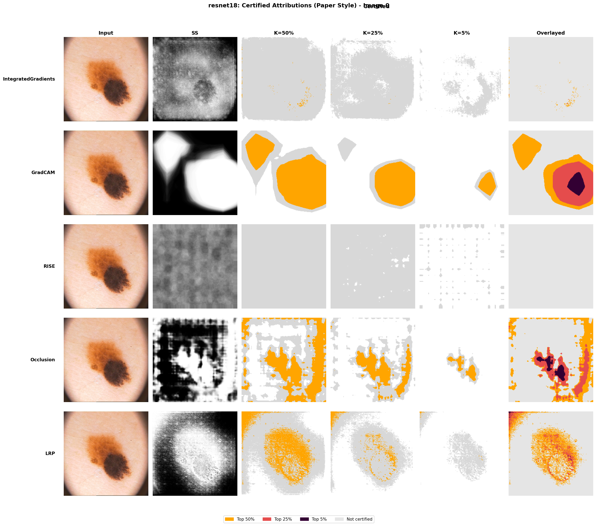

# Certified Attribution for Medical Imaging

Certified pixel-level explanations for medical images using sparsification and randomized smoothing, plus an ISIC-specific grid (patch-level) certification mode. Precomputed figures for robustness and faithfulness are included in `outputs/`.

## Highlights

- Pixel-level certification across Brain MRI, Chest X-ray, Fundus (APTOS), and ISIC.
- **Grid-based ISIC certification implements true DiFull** (paper's approach): cells are processed separately through the backbone for full disconnection.
- Unified attribution backends: Integrated Gradients, Grad-CAM, RISE, Occlusion, LRP.
- Precomputed evaluation plots and paper-style panels ready for reports.

## Setup

1. Create an environment (Python 3.10+):
   - `pip install -r requirements.txt`
   - or `conda env create -f environment.yml`
2. Place data under `data/raw/<dataset>/{train,val,test}` as expected by the dataset loaders.
3. (Optional) Precompute grids for ISIC with your own `grid.pt` using the utilities in `src/datasets`.

## Train (ISIC example)

Train multiple backbones on ISIC:

```
python train_isic_server.py --models resnet18 resnet50 densenet121 \
    --epochs 50 --batch_size 32 --data_root data/raw/isic \
    --checkpoint_dir outputs/checkpoints/isic
```

## Certify pixel-level (single-head)

Certify ISIC attributions with randomized smoothing:

```
python certify_isic_server.py \
    --checkpoint outputs/checkpoints/isic/resnet18/best.pt \
    --sigma 0.15 --num_samples 100 --tau 0.75 --k_percents 50 25 5 \
    --device cuda
```

Artifacts are written under `outputs/certifications/isic/` (paper-style panels and Figure 4-style grids).

## Certify grid-based ISIC (patch-level, DiFull)

True DiFull implementation following the paper: each grid cell is processed **separately** through the backbone, ensuring cells are fully disconnected. Attribution is computed w.r.t. the full grid image, but only the target cell influences the model output. This provides ground truth "possible vs impossible" regions for localization evaluation.

```
python certify_grid_isic_server.py \\
    --grid_pt data/processed/isic/grid.pt \\
    --checkpoint outputs/checkpoints/isic/resnet18/best.pt \\
    --sigma 0.15 --num_samples 100 --tau 0.75 --k_percents 50 25 5 \\
    --save_dir outputs/certifications/grid_isic \\
    --heatmap_dir outputs/certifications/grid_isic/panels
```

## Precomputed results (quick links)

- Certified panels: `outputs/certifications/isic/resnet18_img0_paper_style.png`
- Robustness summary (Experiment 2): `outputs/eval/experiment2/robustness/summary/figures/summary_mean_pct_certified.png`
- Faithfulness summary (Experiment 2): `outputs/eval/experiment2/faithfulness/summary/figures/overall_confidence_curves.png`

## Visual preview




## Troubleshooting

- **DiFull grid certification**: Each cell is now processed separately through the backbone (true disconnection per paper). Attribution is computed over the full grid, but only the target cell can influence the output.
- For CUDA memory errors, lower `--batch_size` or `--num_samples` during certification.
- Data missing errors: verify `data/raw/<dataset>/<split>/images` and labels files expected by the dataset loader (see `src/datasets`).

## Repository structure (essentials)

- `src/` core code: `datasets/`, `models/`, `train/`, `certify/`, `xai/`
- Top-level scripts: `train_isic_server.py`, `certify_isic_server.py`, `certify_grid_isic_server.py`
- Outputs: `outputs/certifications/` (panels), `outputs/eval/experiment1|2/` (plots and summaries)
