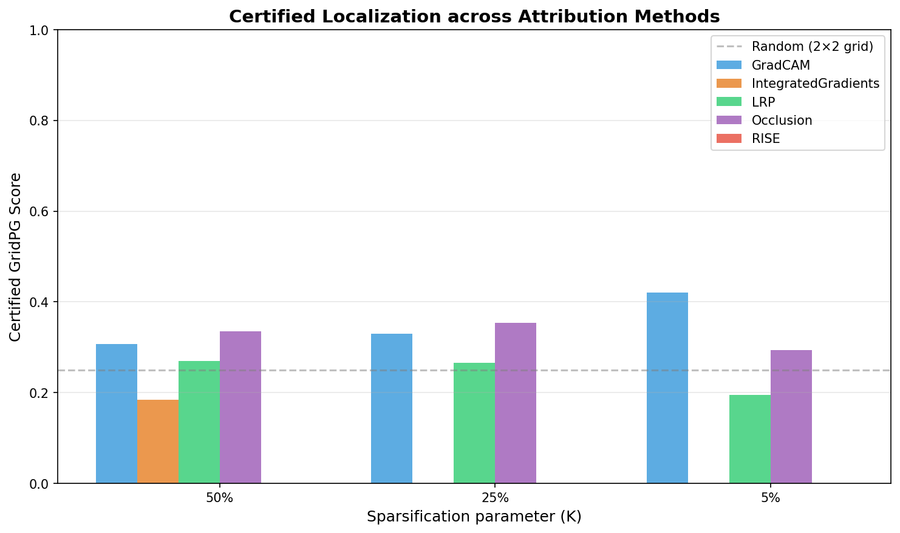
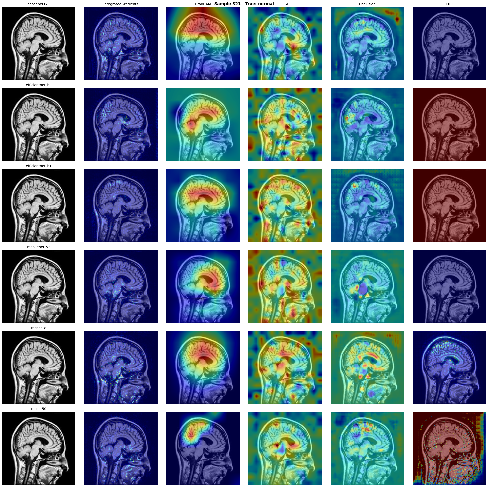
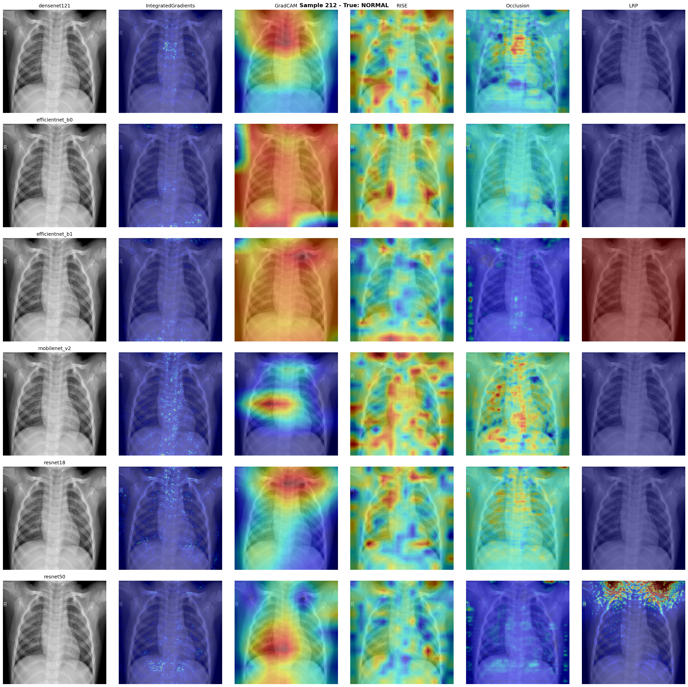
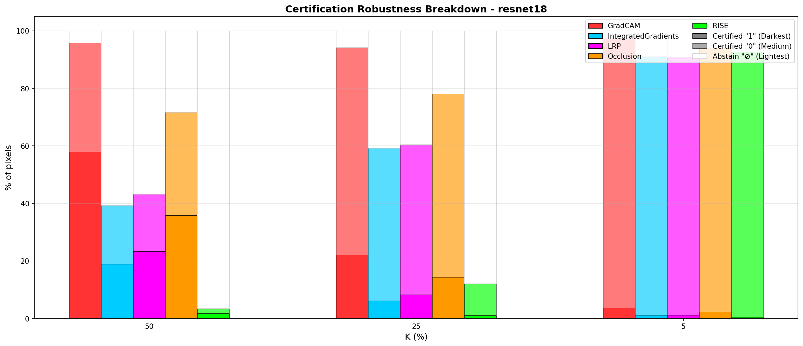
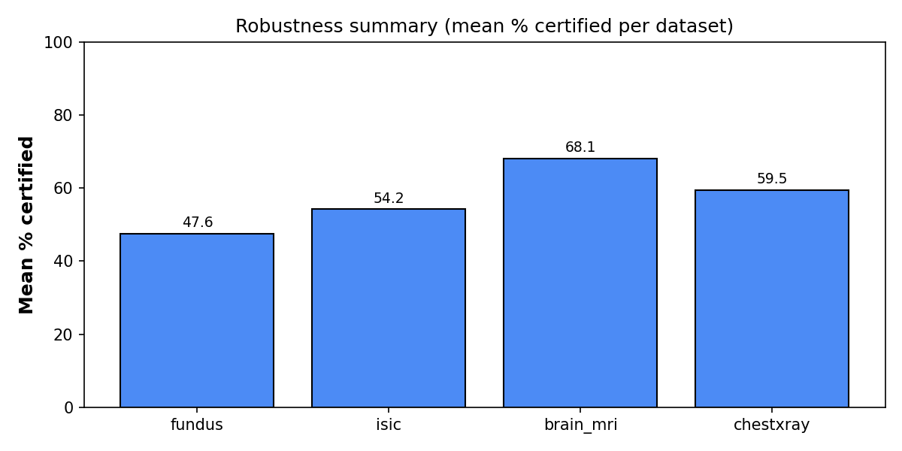
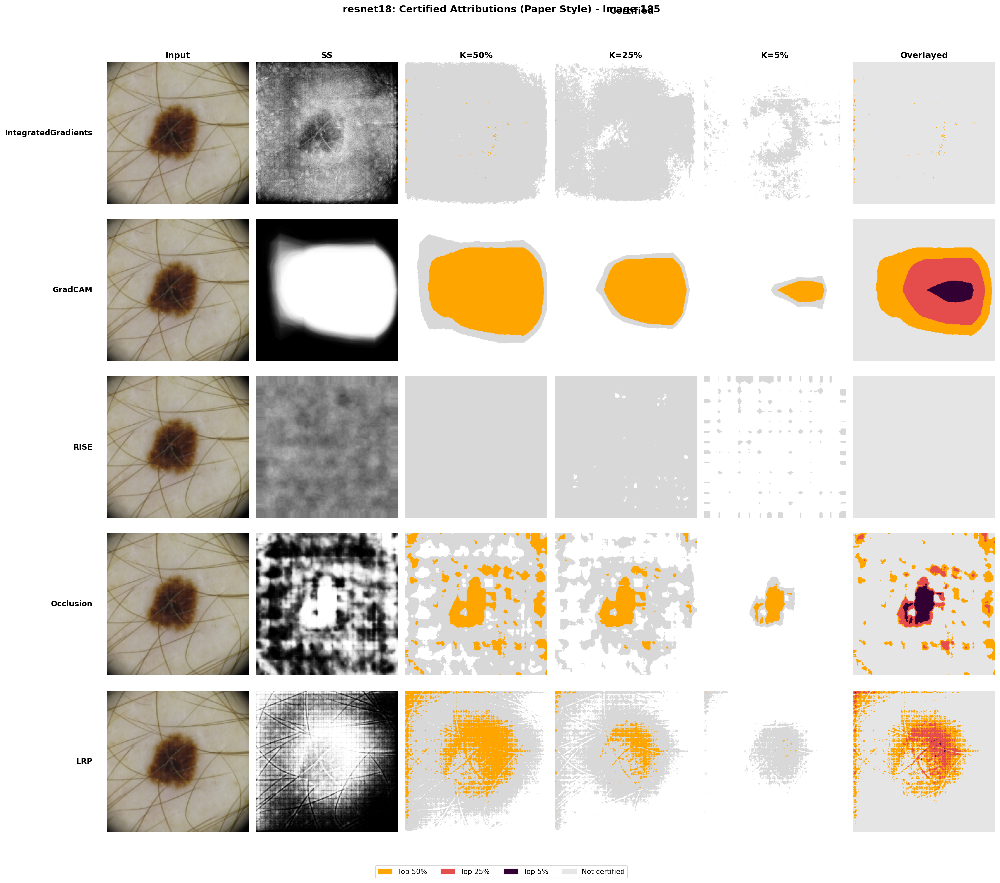
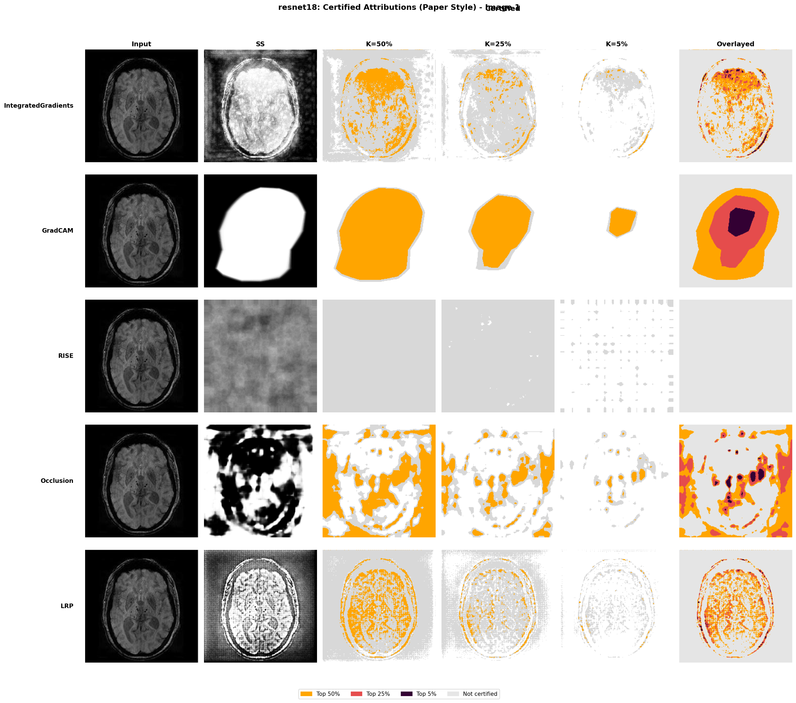
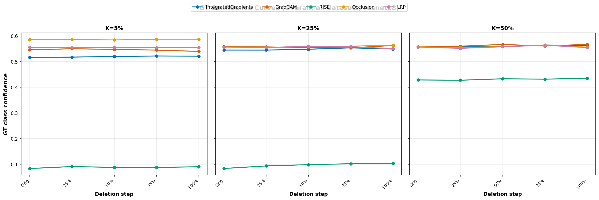

# Pixel-Level Certified Explanations for Medical Imaging

This project implements pixel-level certified attributions for medical imaging classifiers using randomized smoothing and top-K sparsification. Based on [Anani et al. 2025](https://arxiv.org/abs/2506.15499) and grid-based evaluation from [Rao et al. 2022](https://arxiv.org/abs/2205.10435), we apply the certification framework to four medical imaging datasets and introduce synthetic grid-based testing with known ground truth.


_Example: Grid-based localization (GridPG) scores across methods and K values._

## Overview

Attribution methods explain model predictions by highlighting important pixels, but [Ghorbani et al. 2019](https://arxiv.org/abs/1810.03292) showed these explanations are fragile: small perturbations completely change attributions while predictions stay correct. Despite this, almost no medical imaging work has certified attribution robustness.

This project:

- **Certifies** pixel-level attributions across four medical datasets using randomized smoothing
- **Evaluates** five attribution methods (Integrated Gradients, Grad-CAM, LRP, RISE, Occlusion)
- **Tests** localization using synthetic 2×2 grids where the correct region is known by construction
- **Reveals** critical limitations: certified pixels often fail to align with ground truth


_Attribution visualizations for Brain MRI across five methods: Integrated Gradients, Grad-CAM, RISE, Occlusion, and LRP._

## Datasets

Four medical imaging datasets spanning different modalities and diagnostic tasks:

| Dataset          | Modality           | Task                         | Classes |
| ---------------- | ------------------ | ---------------------------- | ------- |
| ChestX-ray14     | X-ray (grayscale)  | Pneumonia detection          | 2       |
| Brain MRI Tumor  | MRI (grayscale)    | Tumor classification         | 4       |
| APTOS 2019       | Fundus (color)     | Diabetic retinopathy grading | 5       |
| ISIC Skin Lesion | Dermoscopy (color) | Skin lesion classification   | 7       |


_Representative sample from ChestX-ray14 dataset (with method outputs)._

## Experiments

### Experiment 1: Cross-Architecture Comparison

**Setup:** 5 images per dataset × 4 architectures (ResNet-18, DenseNet-121, MobileNetV2, EfficientNet-B1)

**Goal:** Understand if model architecture affects certification behavior

**Result:** Architecture doesn't significantly change which attribution methods certify best. Gradient-based methods (IG, Grad-CAM) consistently outperform perturbation-based methods (RISE, Occlusion) by 10-20%.


_Robustness results for Brain MRI (ResNet-18). Gradient methods dominate across models._

### Experiment 2: Large-Scale Evaluation

**Setup:** 100 images per dataset × ResNet-18 only

**Goal:** Scale up to validate Experiment 1 findings with statistical confidence

**Result:** Patterns from Experiment 1 hold at scale. Brain MRI most robust (68% certified), APTOS fundus least robust (48%). Certification drops monotonically as sparsity K increases (50% → 25% → 5%).


_Average pixel certification rates across datasets. Brain MRI (grayscale) significantly more robust than color datasets._

### Grid-Based Localization

**Setup:** Synthetic 2×2 grids from ISIC images with known target cell (top-left)

**Goal:** Test whether certified pixels localize to the correct region when ground truth is known

**Result:** Catastrophic failure. RISE: 0.0 (complete failure). IntegratedGradients: 0.0 at sparse K. Best method (GradCAM) reaches only 0.42—barely above random chance (0.25).


_Grid certification-style panel for ISIC (bulk certification output)._

## Key Findings

### ✅ Robustness

- **Gradient methods win:** Integrated Gradients and Grad-CAM certify 10-20% more pixels than perturbation methods
- **Modality matters:** Grayscale (Brain MRI: 68%) certifies better than color (APTOS: 48%)
- **Architecture-independent:** All models show similar method rankings


_Certification panel: input image, five attribution heatmaps, and certified labels at $K=50\%$._

### ⚠️ Faithfulness

- **Erratic deletion curves:** Many curves are flat or non-monotonic, suggesting certified pixels aren't genuinely important
- **Better methods exist:** IG/Grad-CAM show steeper confidence drops than RISE/Occlusion
- **Aggregation masks failures:** Smooth average curves hide per-image instability


_Average faithfulness curves. Flat regions indicate certified pixels have minimal impact on predictions._

### ❌ Localization (Grid Failure)

- **RISE complete failure:** GridPG = 0.0 across all K values
- **IntegratedGradients collapses:** 0.0 at K=25% and K=5% despite good performance on standard images
- **Best methods barely exceed random:** GradCAM peaks at 0.42 (random = 0.25)
- **Critical implication:** If certification fails when we know the answer, can we trust it on real medical images?

## Critical Assessment

The grid localization failures raise fundamental questions about certified attributions:

1. **Are we certifying noise?** Randomized smoothing may certify pixel patterns that are stable by chance rather than semantically meaningful
2. **Method limitations:** Attribution methods designed for single objects struggle with multi-lesion grids
3. **Model quality matters:** If the classifier is weak or uses shortcuts, certified attributions inherit those flaws
4. **Faithfulness concerns:** Flat deletion curves suggest many certified pixels don't actually influence predictions

**Conclusion:** Pixel-level certification is theoretically sound but may need fundamentally better models and attribution methods before clinical deployment.

## Installation

```bash
conda env create -f environment.yml
conda activate certified-attribution
```

## Project Structure

```
certified-attribution-medical-imaging/
├── src/
│   ├── datasets/          # Medical dataset loaders + grid generation
│   ├── models/            # CNN architectures and multi-head wrapper
│   ├── xai/               # Attribution methods (IG, Grad-CAM, RISE, Occlusion, LRP)
│   └── certify/           # Certification framework with randomized smoothing
├── outputs/
│   ├── certifications/    # Certified attribution visualizations
│   ├── eval/              # Experiment results and metrics
│   └── checkpoints/       # Trained model weights
├── report/                # LaTeX project report with full analysis
└── data/raw/              # Medical imaging datasets

```

## References

- [Anani et al. 2025] "Pixel-level Certified Explanations via Randomized Smoothing" - [arXiv:2506.15499](https://arxiv.org/abs/2506.15499)
- [Rao et al. 2022] "Towards Better Understanding Attribution Methods" - [arXiv:2205.10435](https://arxiv.org/abs/2205.10435)
- [Ghorbani et al. 2019] "Interpretation of Neural Networks is Fragile" - [arXiv:1810.03292](https://arxiv.org/abs/1810.03292)

---

**Full technical details, algorithms, and analysis available in `report/project_report.pdf`**
